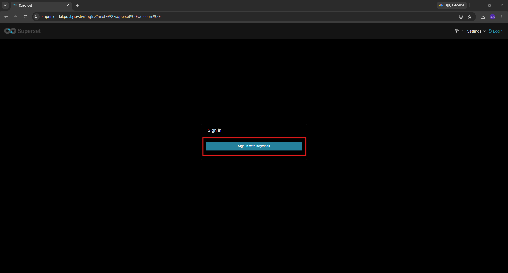
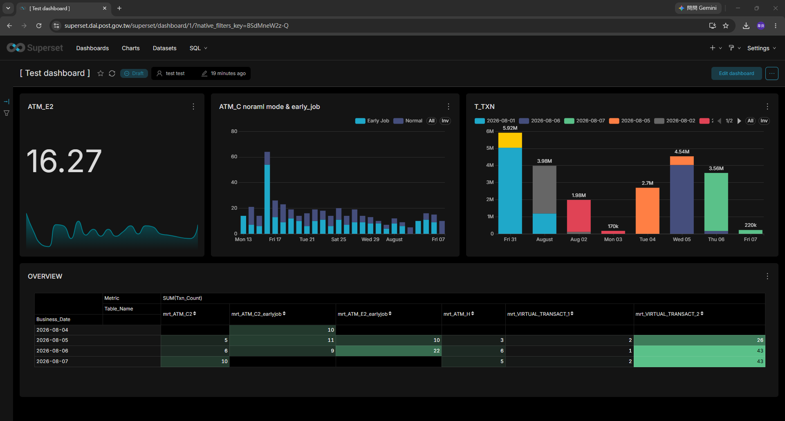
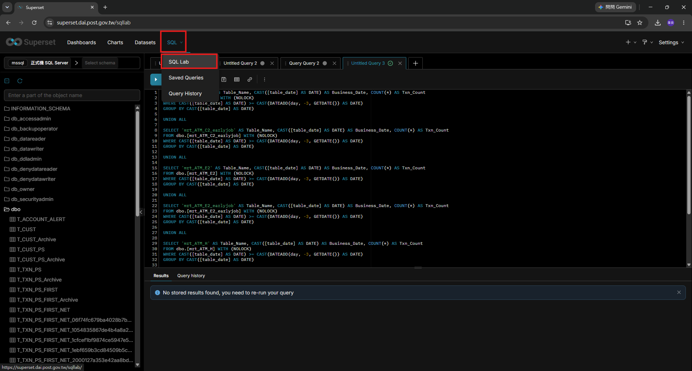
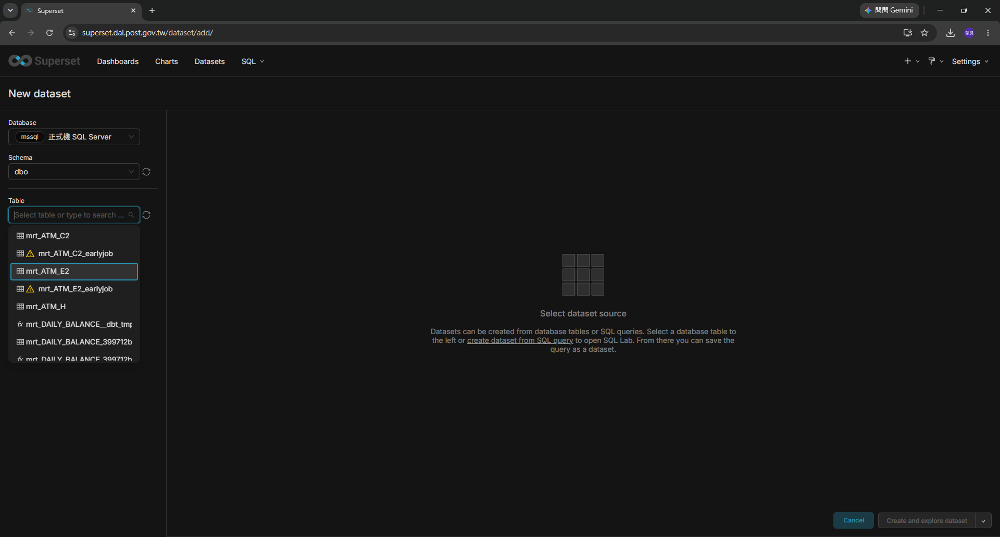
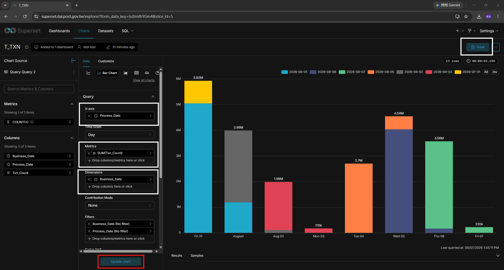
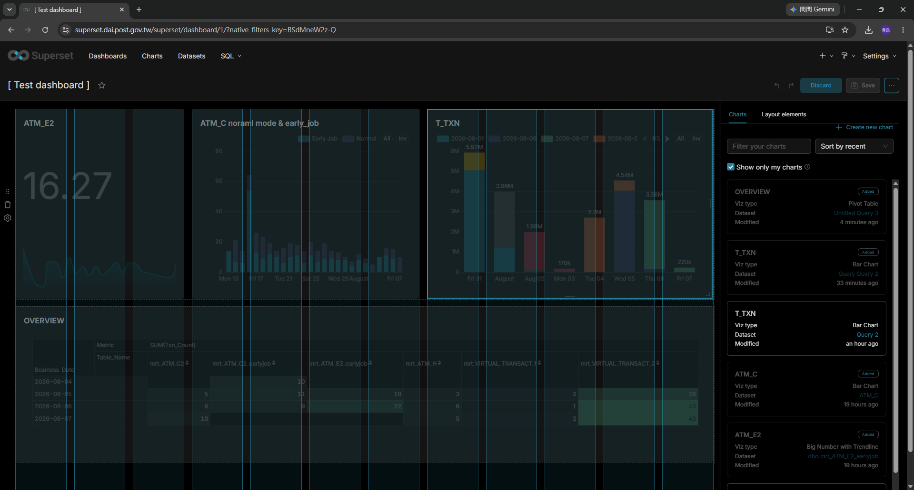

# 01 · Superset · 使用手冊

> 對象：**要看報表、做圖表的人**（業務單位、開發人員）。
> 不需要懂 Dagster、不需要會寫程式；SQL 只有做 Virtual Dataset 時才需要。

---

## 1. 登入

`https://superset.dai.post.gov.tw`

點 **Sign in with Keycloak**，用**公司帳號密碼**登入，成功後跳回 Superset。



> 這是唯一的登入方式。**Superset 上不會有另外一組帳號密碼**——
> 權限統一在 Keycloak 管，見 [02 · 第 4 節](./02_Superset_資料庫連線與權限.md#4-使用者與權限統一在-keycloak-管)。

登不進去的話：

| 症狀 | 原因 | 找誰 |
|---|---|---|
| 跳到 Keycloak 但登入失敗 | LDAP 帳號問題 | 系統管理員 |
| 登入成功但回到 Superset 顯示空白／無權限 | Keycloak 群組沒對應到 Superset 角色 | 系統管理員，見 [02 · 第 4 節](./02_Superset_資料庫連線與權限.md#4-使用者與權限統一在-keycloak-管) |
| 一直在兩邊跳轉 | session / cookie 問題 | 先清瀏覽器 cookie 再試 |

---

## 2. 四個名詞，先搞清楚

```
Database（資料庫連線）      ← 管理員建，一般使用者不會碰
    └─ Dataset（資料集）     ← 一張表，或一段 SQL 的結果
          └─ Chart（圖表）   ← 一張圖
                └─ Dashboard（儀表板）  ← 一頁多張圖，給人看的成品
```

**由下往上讀比較好懂**：你最後要給業務單位看的是 Dashboard，
Dashboard 由 Chart 組成，每張 Chart 背後一定有一個 Dataset。

> ⚠️ **Dataset 不是資料的複本。**
> 每次開圖表，Superset 都即時去資料庫查一次。
> 所以「圖表數字沒更新」的原因通常在 Dagster / dbt 那邊，不是 Superset。

---

## 3. 看別人做好的 Dashboard

```
上方選單 Dashboards → 點名稱
```

常用操作：

| 想做什麼 | 怎麼做 |
|---|---|
| 換日期區間 | 用 Dashboard 上方的篩選器（Filter） |
| 看某張圖背後的數字 | 圖表右上 **⋮ → View as table** |
| 匯出成 CSV | 圖表右上 **⋮ → Download → Export to .CSV** |
| 匯出整頁成圖片 | Dashboard 右上 **⋮ → Download → Download as Image** |
| 加到我的最愛 | 名稱旁邊的 ☆ |



上方那一排：`☆`（最愛）、`⟳`（重新整理全部圖表）、`Draft/Published` 狀態、
擁有者、最後修改時間；右邊是 **Edit dashboard** 與 `⋯`（匯出、下載、分享）。

---

## 4. 用 SQL Lab 查資料

適合「我只是想撈一份資料出來」的情況。

```
上方選單 SQL → SQL Lab
  1. 左上選 Database（例如「正式機 SQL Server」）
  2. 選 Schema（例如 dbo）
  3. 中間輸入 SQL
  4. Ctrl + Enter 執行（或按左邊的 ▶）
  5. 下方 Results 看結果，可以 Download to CSV
```



左側會列出該 schema 底下所有資料表，點一下就會展開欄位；
上方可以開多個 query 分頁（`Untitled Query 1`、`Query 2`…），彼此獨立。
`SQL` 選單底下另外有 **Saved Queries**（存起來的查詢）與
**Query History**（跑過的紀錄）。

**注意事項：**

- 查詢有逾時限制，撈大量資料請務必**加上日期條件**
- Superset 對資料庫是**唯讀**的，`INSERT` / `UPDATE` / `DROP` 不會成功，也不要嘗試
- 撈出來的資料如果含個資，**匯出的 CSV 就是一份個資檔**，請依公司規定處理

---

## 5. 做一張 Chart

### 5-1. 先有 Dataset

**方式 A：直接用一張實體表**

```
上方選單 Datasets → 右上 + Dataset
  Database / Schema / Table 三個下拉選一選
  → 右下 Create and explore dataset
```



> Table 下拉裡 `⊞` 圖示是實體表、`fx` 是 view；
> 有 ⚠️ 的表示 Superset 抓不到部分欄位資訊，通常還是能用。

**方式 B：用一段 SQL（Virtual Dataset）**

```
SQL Lab 裡把 SQL 寫好、跑出正確結果
  → 右上 Save → Save dataset
  → 取一個看得懂的名字
```

> 需要 join、需要算欄位的時候用方式 B。
> 命名建議帶用途，例如 `vd_每日高風險交易_近90天`，
> 之後別人在清單裡才找得到。

### 5-2. 選圖表類型並拉欄位

```
Charts → + Chart → 選 Dataset → 選圖表類型 → Create new chart
```

常用類型：

| 想表達 | 用哪種 |
|---|---|
| 隨時間變化 | Line Chart / Area Chart |
| 類別之間比大小 | Bar Chart |
| 一個關鍵數字 | Big Number（可加趨勢線） |
| 明細清單 | Table |
| 佔比 | Pie Chart（**類別超過 6 個就不要用**） |

中間的 **Data** 分頁填這幾格：

| 欄位 | 填什麼 |
|---|---|
| **X-axis** | 橫軸要放什麼（通常是日期欄位） |
| **Time Grain** | 日／週／月 |
| **Metrics** | 要算什麼（`COUNT(*)`、`SUM(Txn_Count)`…） |
| **Dimensions** | 要按什麼再切一層（分行、風險等級…） |
| **Filters** | 篩選條件 |



改完按左下角的 **Update chart** 看預覽，滿意後按右上角 **Save**。

> 左邊 **Chart Source** 那一欄列出這個 Dataset 有哪些 Metrics 與 Columns，
> 直接拖到中間的格子裡也可以。

---

## 6. 做一個 Dashboard

```
Dashboards → + Dashboard
  → 取名字
  → 右側 Charts 清單，把要的圖拖到畫面上
  → 拖動邊界調整大小、用 Tabs / Header 分區
  → 右上 Save
```



右側 **Charts** 分頁列出所有圖表（勾 `Show only my charts` 只看自己的），
拖到左邊畫布上即可；**Layout elements** 分頁有分隔線、標題、Tab 等版面元件。
編輯中隨時可以 **Discard**（放棄）或 **Save**。

**加篩選器**（讓看的人可以自己換日期、換分行）：

```
左側 → Add/Edit Filters
  → + Add filter
  → Filter type 選 Value（下拉）或 Time range（日期）
  → 指定 Dataset 與欄位
  → 選擇要套用到哪些 Chart
```

**發布給別人看**：

```
Dashboard 右上 → ⋮ → Edit properties → Owners / Access
```

實際能不能看到，還要看使用者的角色與資料權限，見
[02_Superset_資料庫連線與權限](./02_Superset_資料庫連線與權限.md)。

---

## 7. 命名與整理習慣

清單一旦超過三十個就開始難找，建議一開始就定規則：

| 物件 | 建議命名 | 例 |
|---|---|---|
| Virtual Dataset | `vd_用途_範圍` | `vd_ATM異常提領_近90天` |
| Chart | `用途 - 圖型` | `ATM異常提領趨勢 - 折線` |
| Dashboard | `對象 - 主題` | `稽核室 - 每日詐欺偵測概況` |

再加上 **Tags**（Superset 的標籤功能）分類，例如 `稽核`、`每日`、`測試中`。

> 🧹 **做壞的、試驗性的 Chart 請自己刪掉。**
> 沒有人會幫你清，累積久了大家會找不到真正在用的那幾張。

---

## 8. 常見問題

| 症狀 | 原因 | 怎麼辦 |
|---|---|---|
| 圖表數字沒更新 | 資料表本身沒更新 | 去 Dagster 看當天批次有沒有跑完（[Dagster維運手冊](../../Dagster維運手冊/日常維運/01_維運人員_每日操作手冊.md)） |
| 圖表數字沒更新，但資料表有新資料 | Superset 快取 | 圖表右上 **⋮ → Force refresh** |
| 查詢逾時 | 撈太多資料 | 加日期條件；真的需要全量請找開發人員改成彙總表 |
| 看不到某個 Dataset | 沒有那個資料來源的權限 | 找管理員，見 [02](./02_Superset_資料庫連線與權限.md) |
| 中文顯示成方框 | 容器內缺中文字型 | 找管理員，見 [進階調整 · 12](../進階調整/12_疑難排解.md) |
| 匯出 CSV 中文亂碼 | Excel 預設編碼 | 用「資料 → 從文字/CSV」匯入並選 UTF-8 |

---

## 相關文件

- 接新資料庫、開權限 → [02_Superset_資料庫連線與權限](./02_Superset_資料庫連線與權限.md)
- SSO 與設定檔 → [進階調整 · 11](../進階調整/11_Superset_SSO與設定檔.md)
- 圖表裡的資料怎麼來的 → [Dagster維運手冊](../../Dagster維運手冊/README.md)
