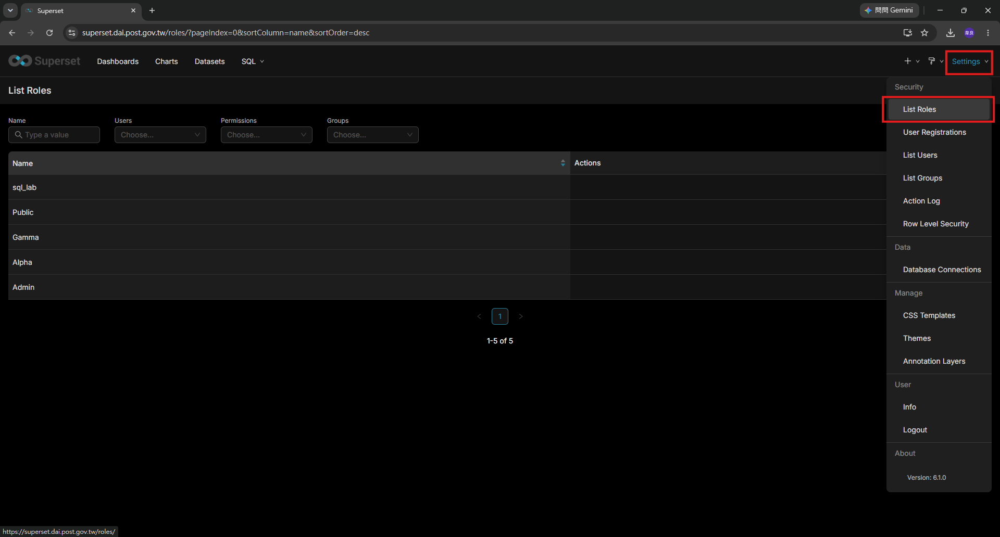

# 02 · Superset · 資料庫連線與權限

> 對象：**Superset 管理員**。
> 這份文件在回答：怎麼接一個新資料庫、怎麼決定誰看得到什麼。

---

## 1. 接一個新的資料庫連線

### 1-1. 事前準備（★先做這一步★）

**在資料庫端建一個唯讀帳號給 Superset 用。**

Superset 是展示層，沒有任何理由需要寫入權限。
用一個有寫入權限的帳號接上去，等於任何一個能進 SQL Lab 的人都能改資料。

```sql
-- PostgreSQL 範例
CREATE USER superset_ro WITH PASSWORD '<強密碼>';
GRANT CONNECT ON DATABASE <資料庫> TO superset_ro;
GRANT USAGE ON SCHEMA <schema> TO superset_ro;
GRANT SELECT ON ALL TABLES IN SCHEMA <schema> TO superset_ro;
-- 之後新建的表也要能讀
ALTER DEFAULT PRIVILEGES IN SCHEMA <schema> GRANT SELECT ON TABLES TO superset_ro;
```

```sql
-- SQL Server 範例
CREATE LOGIN superset_ro WITH PASSWORD = '<強密碼>';
USE [<資料庫>];
CREATE USER superset_ro FOR LOGIN superset_ro;
ALTER ROLE db_datareader ADD MEMBER superset_ro;
```

**防火牆**：需要開通 `VM5 → <資料庫主機>:<port>`。

### 1-2. 在 Superset 建立連線

```
右上角 Settings → Data 區塊 → Database Connections
  → 右上 + Database
  1. 選資料庫類型（PostgreSQL / Microsoft SQL Server / …）
  2. 填連線資訊，或切到 SQLAlchemy URI 直接貼
  3. 按 Test Connection ← ★一定要按，成功了再存★
  4. Connect
```

SQLAlchemy URI 格式：

```
postgresql+psycopg2://superset_ro:<密碼>@<主機>:5432/<資料庫>
mssql+pyodbc://superset_ro:<密碼>@<主機>:1433/<資料庫>?driver=ODBC+Driver+18+for+SQL+Server&Encrypt=yes&TrustServerCertificate=yes
```

### 1-3. Advanced 分頁的四個開關

| 選項 | 建議 | 為什麼 |
|---|---|---|
| **Expose database in SQL Lab** | ✅ 開 | 不開的話 SQL Lab 選不到這個資料庫 |
| **Allow CREATE TABLE AS / CTAS** | ❌ 關 | 唯讀帳號本來就做不到，開了只是誤導 |
| **Allow DML** | ❌ **一定要關** | 開了等於允許在 SQL Lab 下 UPDATE / DELETE |
| **Asynchronous query execution** | 視情況 | 要跑長查詢才需要，需要 Celery worker 才會生效 |

### 1-4. 驗證

```
SQL Lab → 選新建的 Database → 隨便查一張表
SELECT 1;              -- 先確認連得到
SELECT COUNT(*) FROM <某張表> ;
```

再驗一次**寫不進去**（應該要失敗）：

```sql
CREATE TABLE superset_write_test (id int);
-- 預期：permission denied，這才是對的
```

---

## 2. 主機名稱解析不到的話

VM5 的容器 `dns:` 被限定在公司 DNS（見部署手冊 Phase 2-1，
`10.10.43.1` / `10.10.43.2`），這是 glibc DNS 弱點的圍堵措施。

```bash
# 在 VM5 確認 Superset 容器解不解得到那台資料庫
docker exec superset getent hosts <資料庫主機名稱>
```

解不到的話兩個選擇：

1. 請 IT 把該主機名稱加進公司 DNS 區域（**建議**）
2. 連線設定直接填 IP（缺點：資料庫換機時要改設定）

> 測試環境（如 multipass）連不到公司網段是預期的，要在正式環境才驗得出來。

---

## 3. 權限模型

Superset 的權限分兩層，**兩層都要對，使用者才看得到東西**：

```
第一層：角色（Role）          能不能進某個功能（SQL Lab、建 Chart、管理設定）
第二層：資料來源（Datasource） 看不看得到某個 Dataset
```

**UI 路徑（Superset 6.1.0）**：

```
右上角 Settings → Security 區塊
  ├─ List Roles      ← 角色與權限
  ├─ List Users      ← 使用者（★不要手動新增★）
  ├─ List Groups     ← 群組
  └─ Row Level Security  ← 同一張表只讓某些人看某些列
```



### 3-1. 內建角色

| 角色 | 能做什麼 | 對應到誰 |
|---|---|---|
| `Admin` | 全部，包含改設定、管理使用者 | 系統管理員（**盡量少人**） |
| `Alpha` | 建 / 改所有 Dataset、Chart、Dashboard，不能改系統設定 | 開發人員 |
| `Gamma` | **只能看被授權的資料**，可以自己做 Chart / Dashboard | 業務單位 |
| `sql_lab` | 可以用 SQL Lab（**要跟上面的角色搭配一起給**） | 需要自己撈資料的人 |
| `Public` | 未登入者。**我們沒有開放匿名存取，這個角色應該保持沒有任何權限** | — |

> `Gamma` **預設看不到任何 Dataset**，要另外授權（見 3-2）。
> 這是刻意的：預設看不到，比預設全看得到安全。

### 3-2. 建一個「資料角色」給某群人看某些資料

```
Settings → List Roles → + Role
  Name: 稽核室
  Permissions: 搜尋 datasource access，加入
    - datasource access on [正式機 SQL Server].[mrt_ATM_C2](id:12)
    - datasource access on [正式機 SQL Server].[mrt_ATM_E2](id:15)
  → Save
```

**這個角色建好之後，不要在 Superset 上一個一個加人**——
改成在 Keycloak 建對應的群組，見第 4 節。

---

## 4. 使用者與權限統一在 Keycloak 管

> ✅ **原則：Superset 上不建帳號、不手動指派角色。**
> 誰能登入、誰是什麼角色，全部由 Keycloak 決定。

### 4-1. 為什麼

| | 在 Superset 上開帳號 | 統一在 Keycloak 管 |
|---|---|---|
| 新人加入 | 要記得在每套系統各開一份 | 加進 Keycloak 群組，四套系統一次到位 |
| 離職 | **容易漏掉**，帳號會留著還能登入 | LDAP 停用 → 所有系統都登不進去 |
| 稽核「誰有權限」 | 要一套一套系統查 | 看 Keycloak 群組成員即可 |
| 權限調整 | 每套系統各改一次 | 改群組就好 |

### 4-2. 對應機制

```
公司 LDAP
   │ Keycloak User Federation 同步
   ▼
Keycloak 群組（例如 dai-superset-viewer）
   │ 登入時把群組資訊放進 token
   ▼
superset_config.py 的 AUTH_ROLES_MAPPING
   │ 把「Keycloak 群組」對應到「Superset 角色」
   ▼
使用者拿到角色 → 決定他看得到什麼
```

設定檔怎麼寫見
[進階調整 · 11 · 第 3 節](../進階調整/11_Superset_SSO與設定檔.md#3-角色怎麼對應)。

### 4-3. 建議的群組規劃

| Keycloak 群組 | Superset 角色 | 給誰 |
|---|---|---|
| `dai-superset-admin` | `Admin` | 系統管理員（1–2 人） |
| `dai-superset-dev` | `Alpha` + `sql_lab` | 開發人員 |
| `dai-superset-user` | `Gamma` + `sql_lab` | 需要自己撈資料的業務單位 |
| `dai-superset-viewer` | `Gamma` | 只看 Dashboard 的業務單位 |
| `dai-superset-<單位>` | 該單位的自訂資料角色（3-2 建的） | 控制看得到哪些 Dataset |

一個人可以同時屬於多個群組，角色會疊加。
例如稽核室的人：`dai-superset-viewer` + `dai-superset-稽核室`。

### 4-4. 新人加入 / 離職

**加入**：
```
1. 系統管理員把人加進對應的 Keycloak 群組
2. 請對方自己登入一次 Superset（第一次登入才會建立本機使用者紀錄）
3. Settings → List Users 確認他的 Roles 是對的
```

**離職 / 轉調**：
```
1. LDAP 帳號停用（★這是主要手段★，停用後就登不進來了）
2. 從 Keycloak 群組移除
3. 檢查他是不是某些 Dashboard 的唯一 Owner
   Dashboards → 篩選 Owner → 有的話先改 Owner 再處理
```

> Superset 上的使用者紀錄可以留著（保留他建立的 Chart 的擁有者資訊），
> 反正登不進來了。

### 4-5. 三個不要

| 不要做 | 為什麼 |
|---|---|
| 在 `Settings → List Users → +` 手動建帳號 | 那會變成不受 LDAP 管理的帳號，離職時不會被停用 |
| 在 `List Users` 直接改某人的 Roles | `AUTH_ROLES_SYNC_AT_LOGIN=True` 時，下次登入就被洗掉，而且不會有任何提示 |
| 給 `Public` 角色任何權限 | 那等於開放匿名存取 |

---

## 5. 管理員檢查清單

新接一個資料庫時：

```
[ ] 資料庫端已建立唯讀帳號，實測寫不進去
[ ] 防火牆 VM5 → 資料庫主機:port 已開通
[ ] 主機名稱在 Superset 容器裡解析得到（或改用 IP）
[ ] Test Connection 通過
[ ] Allow DML 沒有勾
[ ] Expose in SQL Lab 有勾（如果要開放 SQL Lab）
[ ] 建好對應的自訂角色，並實際用一個 Gamma 帳號登入驗證看得到／看不到
[ ] 連線密碼有記錄在公司的密碼保管機制
```

---

## 相關文件

- 一般使用者怎麼用 → [01_Superset_使用手冊](./01_Superset_使用手冊.md)
- SSO 與設定檔細節 → [進階調整 · 11](../進階調整/11_Superset_SSO與設定檔.md)
- 部署與啟動 → [部署手冊 Phase 2-4](../../../README.md)
