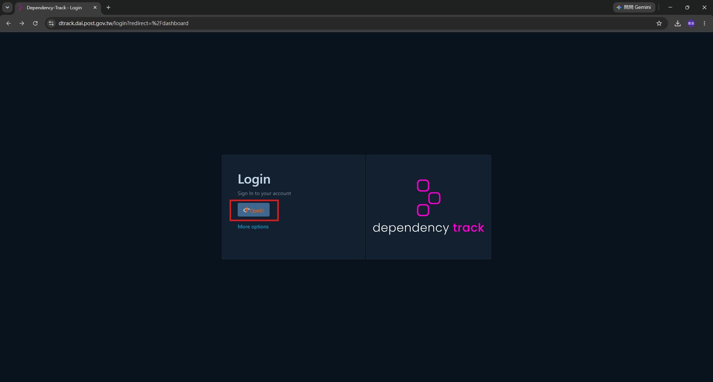
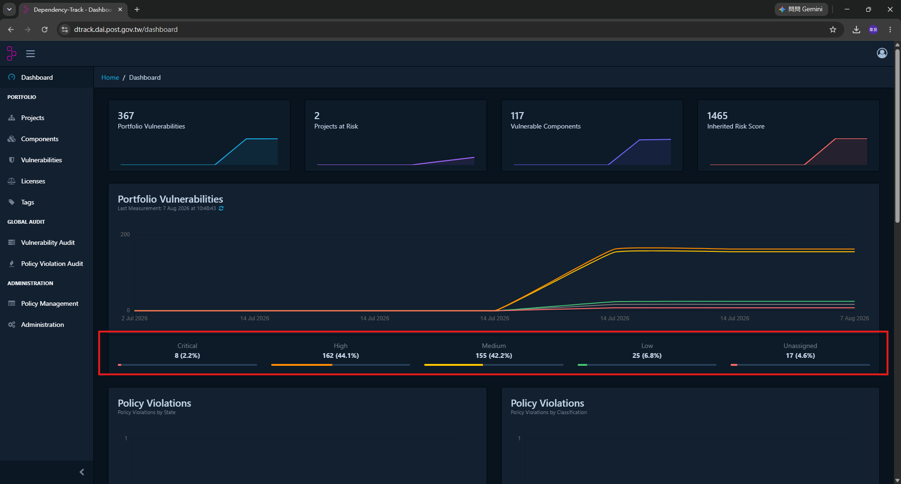
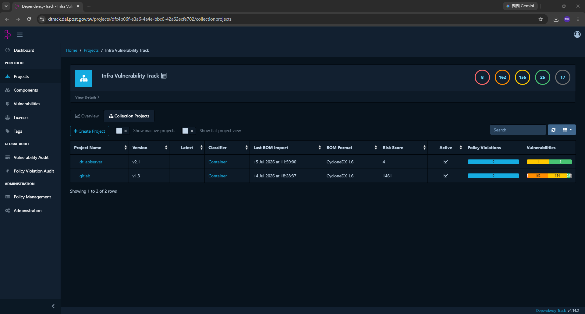
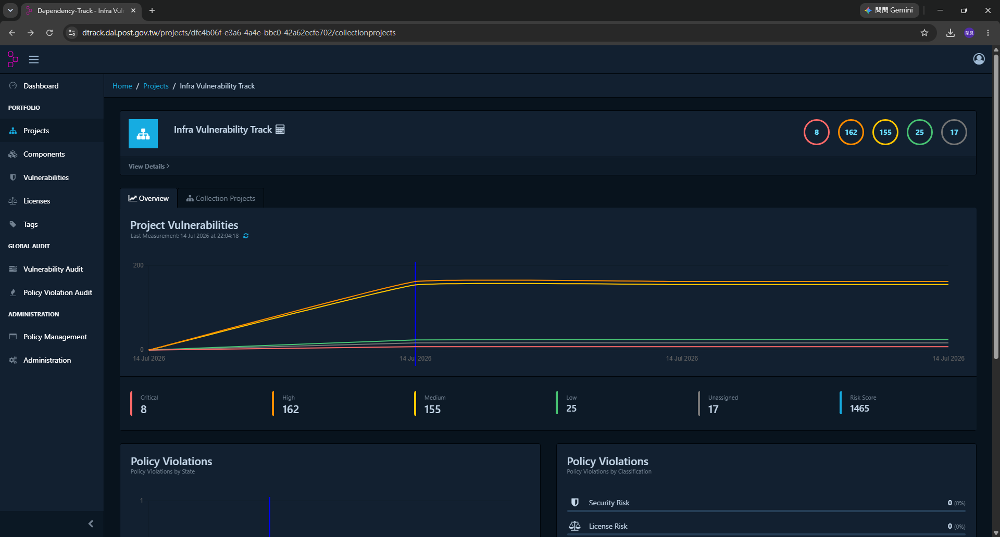
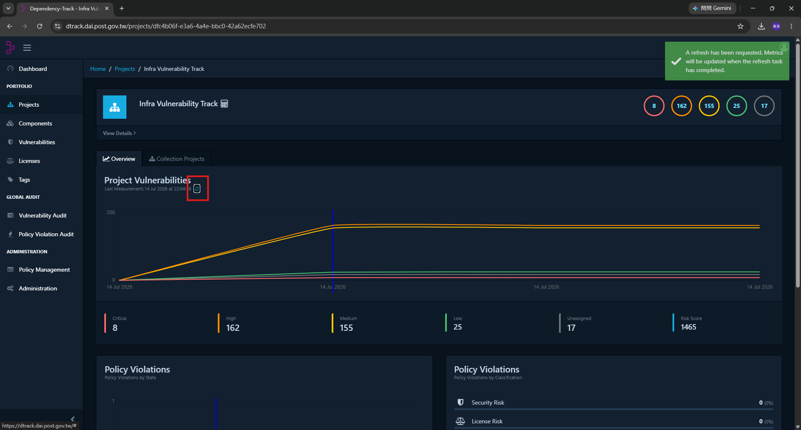

# 03 · D-Track · 看懂弱點報告

> 這份文件在回答：**打開 D-Track 網頁之後，我該看哪裡、看到的數字是什麼意思。**
> 「掃出東西怎麼處理」在 [04_弱掃紅燈與MR被卡住的解除流程](./04_弱掃紅燈與MR被卡住的解除流程.md)。

---

## 1. 登入

`https://dtrack.dai.post.gov.tw`

點 **OpenID** 按鈕走 Keycloak SSO（公司 LDAP 帳密）。



> 本機管理員帳號 `admin` 藏在 **More options** 底下。
> 日常請一律走 SSO，`admin` 只在 SSO 壞掉時當救援用。
>
> **權限不是在 D-Track 上開的**——你能看到什麼、能不能標記例外，
> 由你在 Keycloak 的群組決定，見
> [進階調整 · 10 · 第 3 節](../進階調整/10_D-Track_專案_API_Key_與擋門門檻.md#3-權限統一在-keycloak-管)。

---

## 2. 專案清單怎麼看

**Projects** 分頁會看到類似這樣的清單：

| Name | Version | Last BOM Import | Critical | High | Medium | Low |
|---|---|---|---|---|---|---|
| `bcp-scripts` | `main` | 2026-08-01 03:12 | 0 | 2 | 7 | 12 |
| `bcp-scripts` | `fix/bump-crypto` | 2026-08-05 10:44 | 0 | 1 | 7 | 12 |
| `dagster-workspace` | `main` | 2026-08-01 03:15 | 0 | 5 | 11 | 20 |

**命名規則**（由 `ci/build_sbom.sh` 自動決定，不要手動改）：

```
Name    = GitLab 專案名稱      （CI_PROJECT_NAME）
Version = 分支名稱             （CI_COMMIT_REF_NAME）
```

所以：

- `main` 那一列 = **正式機上實際在跑的那一版**，這是每天要看的
- 分支名稱那幾列 = 開發中的 MR，合併後就不會再更新，會慢慢累積

> 📌 **要看正式環境的狀況，永遠看 `version = main` 那一列。**
> 功能分支的專案只反映那個 MR 當下的狀態。

> 🧹 **舊分支的專案不會自己消失。** 半年清一次即可
> （Projects → 選取 → Delete），清掉不影響 `main`。

---

## 3. 四個數字是什麼意思

| 等級 | 白話 | 日常（MR / push） | 每季複掃 |
|---|---|---|---|
| **Critical** | 遠端就能打、不需要特殊條件、影響嚴重 | 🚫 擋 | 🚫 擋 |
| **High** | 影響嚴重，但需要一些前提條件 | 🚫 擋 | 🚫 擋 |
| **Medium** | 影響有限或利用難度高 | ⚠️ 只警告 | 🚫 **擋** |
| **Low** | 資訊揭露之類，實務影響很小 | 記錄 | 記錄 |

**兩個門檻都不含作業系統層套件**（`glibc`、`libc-bin`…）——
那些由 CI 自動放行，理由與做法見
[04 · 第 2 節](./04_弱掃紅燈與MR被卡住的解除流程.md#2-作業系統層套件libc-那一類已經自動放行)。

嚴重度來自 CVE 本身的 CVSS 分數，不是我們自己定的。

> **數字只是起點，不是結論。**
> 一個 Critical 出現在「我們根本沒呼叫到的那個函式」裡，實際風險可能很低；
> 一個 Medium 出現在「每天處理客戶資料的那段路徑」上，可能反而該優先修。
> 判斷要看 Component 是誰、我們怎麼用它。

---

## 4. 進到一個專案要看什麼

點專案名稱進去，上方有這幾個分頁：

| 分頁 | 看什麼 | 什麼時候看 |
|---|---|---|
| **Overview** | 四個數字、趨勢圖 | 每天巡的時候 |
| **Components** | 這個專案用了哪些套件、各是哪一版 | 想確認某個套件版本時 |
| **Services** | 外部服務相依 | 少用 |
| **Dependency Graph** | 套件相依關係（誰把誰帶進來的） | 「這個套件我沒裝過啊」的時候 |
| **Audit Vulnerabilities** | 每一筆弱點、可以標記處理狀態 | 要處理弱點時 |
| **Exploit Predictions** | EPSS（被實際利用的機率預測） | 排優先順序時參考 |
| **Policy Violations** | 違反 Policy Management 設的規則 | 有設 policy 才會用到 |

### Audit Vulnerabilities 的欄位


| 欄位 | 你要從它得到什麼 |
|---|---|
| **Component** | 哪個套件、哪一版 |
| **Group** | 套件的命名空間（例如 `com.fasterxml.jackson.core`） |
| **Vulnerability** | CVE 編號，點進去有描述與參考連結 |
| **Severity** | 嚴重度 |
| **Analyzer** | 哪個掃描器報的（`Trivy` = 來自容器映像掃描） |
| **Attributed On** | 這筆弱點是什麼時候被關聯上來的 |
| **Analysis** | 目前被標成什麼狀態（`-` = 還沒有人看過） |
| **Suppressed** | 有沒有被放行 |

左上角幾個按鈕：

| 按鈕 | 做什麼 |
|---|---|
| **Reanalyze** | 用最新的弱點資料庫重新分析這個專案（不用重傳 SBOM） |
| Export VEX / Export VDR | 匯出弱點交換文件，稽核要正式報告時用 |
| Apply VEX | 匯入別人給的 VEX 文件 |
| **Show suppressed findings** | 打開才看得到被放行的項目（含自動放行的 OS 套件） |

點 CVE 編號會進到弱點詳情頁：


- **Overview**：這個 CVE 在講什麼，**文末通常會寫「This vulnerability is fixed in X.Y.Z」** ← 最重要
- **CVSS Base Score / EPSS**：嚴重度與被實際利用的機率
- **Weakness**：CWE 分類
- **Affected Projects**：我們有幾個專案中這一槍

---

## 5. 維運人員每天／每季看什麼

### 每天（1 分鐘）

只需要確認一件事：**`main` 那兩列的 Critical 是不是 0。**

```
Projects → 看 bcp-scripts:main 與 dagster-workspace:main 的 Critical 欄
```

不是 0 的話，代表有東西合併進去之後才被公告，
或是有人用緊急放行合併了——走
[04_解除流程](./04_弱掃紅燈與MR被卡住的解除流程.md)。

> 日常的 pipeline 已經在擋 Critical 了，所以這裡通常都是 0。
> **會變成非 0 的情況本身就值得追。**

### 每季（1/4/7/10 月）

排程跑完之後，把該季的 **Medium** 逐一過一遍（Critical / High 日常就擋掉了，
會留到這裡的通常只剩 Medium）。
檢查清單在 [04 · 第 10 節](./04_弱掃紅燈與MR被卡住的解除流程.md#10-每季弱掃的檢查清單)。

### 想一次看所有專案的總覽

左側 **Dashboard** 是全域的：



上面四個方塊分別是 Portfolio Vulnerabilities（全部弱點數）、Projects at Risk、
Vulnerable Components、Inherited Risk Score；
下面那條紅框處是各嚴重度的分佈。

> 📌 這裡的數字是**所有專案加總**，含所有分支版本與基礎設施映像檔，
> 所以會比單一專案大很多。**判斷「正式環境有沒有問題」還是要看
> `version = main` 那幾列。**

---

## 6. 基礎設施映像檔也在掃（Collection Project）

除了兩個程式碼 repo，我們也把**自己建置的容器映像檔**丟進 D-Track 掃，
用 **Collection Project**（集合專案）把它們收在一起：



| 專案 | 版本 | 是什麼 |
|---|---|---|
| `dt_apiserver` | `v2.1` | D-Track 自己的映像檔（我們有重編過，見部署手冊 Phase 3-4） |
| `gitlab` | `v1.3` | GitLab 映像檔 |

Collection Project 本身沒有自己的 SBOM，它的數字是**底下所有子專案的加總**：



**這些跟 CI 擋門是分開的**：

| | 兩個程式碼 repo | 基礎設施映像檔 |
|---|---|---|
| 誰上傳 SBOM | GitLab CI 自動 | 建置映像檔時手動或另外排程 |
| 掃到弱點會擋 pipeline 嗎 | ✅ 會 | ❌ 不會 |
| 怎麼處理 | 走 [04 的流程](./04_弱掃紅燈與MR被卡住的解除流程.md) | 換 base image 重編映像 |

> 📌 基礎設施映像檔的弱點數量通常很大（大部分是 OS 層套件）。
> **不要拿它的數字去跟程式碼 repo 比**——用途不同。
> 它的價值是「升級映像檔之前，先看看新舊版本差多少」。

---

## 7. 三個容易誤解的地方

**① D-Track 的數字會自己變，即使程式碼沒動。**
它持續同步 NVD / OSV，新公告的 CVE 會直接反映到既有專案上。
所以「上週還是 0 Critical」不代表今天還是。

> 📴 **內網沒有對外網路時，弱點資料庫不會自己更新。**
> 容器映像檔那邊是靠 Trivy 掃的（Audit Vulnerabilities 的 `Analyzer` 欄會寫 `Trivy`），
> 它的弱點資料庫要**人工定期更新**，做法見
> [GitLab維運手冊 · 05_trivy_漏洞資料庫更新](../../GitLab維運手冊/日常維運/05_trivy_漏洞資料庫更新.md)。
> **沒更新的話，每季弱掃掃的是舊資料庫，等於白掃。**

**② 網頁上的數字變了，pipeline 不會自己知道。**
擋門是 job 跑的時候即時查一次 API。網頁紅了但沒有人跑 pipeline，
就不會有人收到通知——這正是「每季弱掃」存在的理由：
把它變成一次**會紅燈的 pipeline**。

**③ 網頁上的數字不是即時的，是「上次量測」的結果。**
Overview 上面寫著 `Last Measurement: ...`，旁邊那個小小的 ⟳ 圖示才是重算：



按下去會出現「A refresh has been requested」，等幾秒重新整理才會看到新數字。

> 💡 **不過你通常不需要手動按。** CI 每次跑 `sca-dtrack` 都會自己呼叫一次重算
> 再讀數字，所以標完例外直接回 GitLab 按 Retry 就好。

---

## 相關文件

- 掃出東西怎麼處理 → [04_弱掃紅燈與MR被卡住的解除流程](./04_弱掃紅燈與MR被卡住的解除流程.md)
- Analysis 狀態與權限 → [附錄 A](../附錄/A_D-Track_Analysis狀態與權限對照.md)
- 專案命名、API Key、門檻設定 → [進階調整 · 10](../進階調整/10_D-Track_專案_API_Key_與擋門門檻.md)
