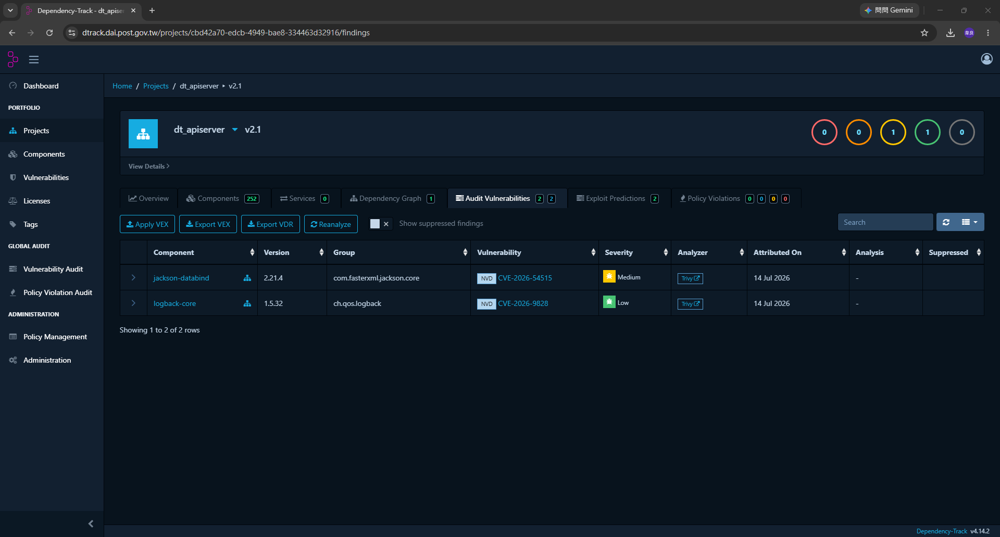
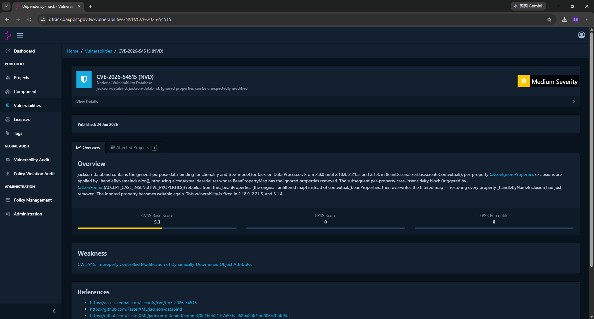

# 04 · 弱掃紅燈與 MR 被卡住的解除流程

> 這份文件在回答：**掃出弱點、pipeline 紅燈、東西上不去，現在該做什麼。**
>
> 環境：Dependency-Track **v4.14.2**、GitLab **CE**。

---

## 0. 先看你是哪一條路

**兩條路的處理方式完全不同，先確認自己在哪一條：**

| | **路 A · 日常上傳被擋** | **路 B · 每季固定掃** |
|---|---|---|
| 什麼時候 | 你開 MR / push，`sca-dtrack` 紅了 | 1/4/7/10 月 1 號 03:00，`sca-dtrack-quarterly` 紅了 |
| 誰要處理 | **你**（開 MR 的人） | **維運人員 + 該套件的負責人** |
| 擋門標準 | Critical + **High** | Critical + High + **Medium** |
| 範圍 | 只有你這個 MR 被擋 | `main` 上的排程 pipeline 紅燈 |
| 目標 | 把你這個 MR 弄綠、合併掉 | **把該季所有 Medium 以上逐一認領完**，不管新舊 |
| 往哪看 | [第 1 節](#1-路-a日常上傳被擋) | [第 2 節](#2-路-b每季固定掃) |

> 📌 **已經評估過的東西不會再擋你第二次。**
> 三個機制在保證這件事，見 [第 3 節](#3-為什麼同一個弱點不會一直來煩你)。

---

## 1. 路 A：日常上傳被擋

### 1-1. 你會看到什麼

MR 頁面的 `sca-dtrack` job 紅燈，log 最後長這樣：

```
=======================================
🛡️  資安掃描結果（bcp-scripts:feat/add-report）
🔥 Critical : 0
🚨 High     : 2
⚠️  Medium   : 7
ℹ️  Low      : 12
   D-Track  : https://dtrack.dai.post.gov.tw/projects/a3f2b91c-...
=======================================
[FAIL]  偵測到 2 個 High 弱點（門檻：High 以上擋）→ 阻擋 Pipeline

  怎麼讓它過（三條路，擇一）：
    1. 升級套件版本 ...
    2. 標記為不受影響 ...
    3. 排期處理 ...
```

**這 2 個 High 一定是「還沒有人評估過」的**——
評估過的在跑到這一步之前就已經被扣掉了（見第 3 節）。

### 1-2. 去哪裡看是什麼

點 log 裡那個 D-Track 連結 → 進到 **Audit Vulnerabilities** 分頁：



`Analysis` 欄是 `-` 的就是還沒有人看過的。點 CVE 編號看詳情，
**Overview 文末的「This vulnerability is fixed in X.Y.Z」是關鍵**：



### 1-3. 決定怎麼處理

```
              有沒有修補版本（Fixed in）？
               │                    │
              有                   沒有
               │                    │
        升級會不會壞？        我們有沒有用到那個弱點功能？
         │        │            │              │
        不會      會          沒用到          有用到
         │        │            │              │
      ★路線1★  ★路線3★     ★路線2★        ★路線3★
      升級版本  排期處理    標記不受影響      排期處理
```

#### 路線 1：升級套件版本（**正解，優先走這條**）

```bash
# bcp-scripts：在你自己的機器上，就在同一條分支上改
vim requirements.txt          # 改那一行的版本

git commit -am "fix: 升級 cryptography 修補 CVE-2026-XXXXX"
git push                       # MR 會自動更新，pipeline 重跑
```

`dagster-workspace` 的套件在映像檔裡，要改 Dockerfile 重編映像再更新
`DTRACK_IMAGE`。

> ⚠️ **離線環境**：升版之前要先把新版 wheel 帶進 VM1 的
> `/run/media/root/D/python_env/req/`，否則正式機上裝不起來，部署完才會爆。
> 合併後也要在 VM1 上更新 venv，並確認 `python -m pip freeze` 與
> `requirements.txt` 一致。

#### 路線 2：標記為不受影響（★去哪裡改，一步一步★）

適用：沒有修補版本，或確認我們沒有用到觸發弱點的那個功能。

```
1. 點 job log 裡的 D-Track 連結
   （★直接點那個連結，不要自己從 Projects 找 —— 版本要對★）

2. 上方分頁點 Audit Vulnerabilities

3. 找到那一筆，點最左邊的 ▶ 展開

4. 展開後的 Analysis 區塊：
     Analysis      → 選 Not Affected
     Justification → 選最貼近的一項
     Details       → ★把理由寫進去，格式見下方★
     Suppress      → 打勾

5. 按 Update

6. 回 GitLab 的那個 job → 右上角 Retry
```

**做完之後應該看到什麼**：

```
=======================================
🛡️  資安掃描結果（bcp-scripts:feat/add-report）
🔥 Critical : 0
🚨 High     : 0          ← 剛剛標掉的已經不算了
⚠️  Medium   : 7
ℹ️  Low      : 12
=======================================
[WARN]  有 7 個 Medium 弱點，這一關不擋，每季複掃時會擋
[ OK ]  SCA 檢查通過
```

看到 `[ OK ] SCA 檢查通過` 就過了。

> 💡 **不用手動按 Refresh Metrics**。
> `ci/build_sbom.sh` 每次執行都會自己重算 metrics 再讀數字。
>
> 標了還是紅的話，八成是：
> - 狀態選成 `In Triage`（**那個不解除擋門**）
> - 沒勾 Suppress
> - 標到別的 project version 去了（比對 job log 印的 `專案名:版本`）

**Details 欄要寫什麼**（四個要素缺一不可）：

```
【人工評估放行】
評估日期：2026-08-07
評估人：王小明
CVE：CVE-2026-54515（jackson-databind 2.21.4，High）

評估結論：Not Affected

理由：
本專案僅使用 jackson-databind 的 ObjectMapper 讀取固定結構的內部設定檔，
未使用 CVE 影響的反序列化路徑，也不會處理外部來源的 JSON。

補償控制：
輸入來源限於本機設定檔，不接受外部輸入。

追蹤：Redmine #1234（下次 base image 改版時一併升級）
```

**誰、什麼時候、根據什麼判斷、有沒有補償控制。**
寫得好的話，這筆理由之後在所有分支都會被自動沿用，**只要寫一次**。

> ⚠️ 標記例外是「會讓紅燈變綠燈」的動作，跟改程式碼一樣要被審視。
> Details 沒寫理由的例外，稽核時等於沒有做過評估。
> **規定：人工標記例外要在 MR 或 Redmine 留紀錄。**

#### 路線 3：排期處理

升級會壞，或確認有影響但一時修不掉：

1. Redmine 開票，寫明 CVE、影響套件、預計處理時間
2. D-Track 標 `Exploitable`，Details 寫上 Redmine 票號
3. **不要**為了讓紅燈消失而亂標 `Not Affected`

這條路**不會讓 MR 過**。真的急著上線見 [第 5 節](#5-緊急放行)。

### 1-4. 綠燈之後

MR 還要滿足其他條件才合得進去：

- Pipeline 全綠（`Pipelines must succeed`）
- 所有 discussion 都 resolved（`All threads must be resolved`）
- **由 Maintainer 按下 Merge**——GitLab CE 沒有核准人數的功能，
  我們的做法是把 Merge 權限收在 Maintainer 手上，作者自己合不了

見 [GitLab維運手冊 · 04 · 第 3 節](../../GitLab維運手冊/日常維運/04_帳號_權限_分支保護.md#3-code-review-的強制性ce-版)。

---

## 2. 路 B：每季固定掃

### 2-1. 這一條跟日常不一樣的地方

| | 日常 | 每季 |
|---|---|---|
| 擋到哪 | High | **Medium** |
| 要處理的範圍 | 只有這次擋住你的那幾筆 | **該季掃出的 Medium 以上，全部** |
| 新舊 | 只會看到新的（舊的已經評估過了） | **不管新舊，只要現在還是 Medium 以上就要認領** |
| 什麼時候算完成 | 你的 MR 綠了 | **那條排程 pipeline 綠了** |

> 🚨 **每季這一條沒處理完，它會一直紅著。**
> 而且今天的 Medium 下個月可能被重新評為 High——
> **到那時候就是所有人的 MR 都被擋，直到有人回頭處理。**
> 所以每季這一次要在當季清完，不要拖。

### 2-2. 事前：先確認弱點資料庫是新的

air-gapped 環境的 Trivy 資料庫不會自己更新。
**沒更新就掃，是拿舊資料庫掃，等於白掃。**

做法見
[GitLab維運手冊 · 05_trivy_漏洞資料庫更新](../../GitLab維運手冊/日常維運/05_trivy_漏洞資料庫更新.md)。

### 2-3. 怎麼跑

排程會自己跑。要手動補跑或重跑：

```
該 project → Build → Pipelines → 右上角 Run pipeline
  Run for branch name : main
  Variables           : Key = SCHEDULE_TYPE   Value = quarterly
                        ← ★不加這個，quarterly job 根本不會出現★
  → Run pipeline
  → 在 pipeline 頁面找到 sca-dtrack-quarterly，點它的 ▶ 才會開始跑
```

### 2-4. 逐筆認領（★這一節是重點★）

打開 job log 裡的 D-Track 連結 → **Audit Vulnerabilities** →
把 Severity 排序，從 Critical 往下做到 Medium。

**每一筆都要有結論，四選一：**

| 結論 | 什麼情況 | 在 D-Track 上怎麼標 | 這一季算完成嗎 |
|---|---|---|---|
| **升級** | 有 Fixed in、升得動 | 改 `requirements.txt`／映像檔 → 走 MR → 合併後標 `Resolved` | ✅ |
| **不受影響** | 沒用到那個弱點路徑 | `Not Affected` + Details 寫理由 + 勾 Suppress | ✅ |
| **誤判** | SBOM 認錯套件或版本 | `False Positive` + Details 寫為什麼 + 勾 Suppress | ✅ |
| **有影響、要排期** | 確認會被打到但一時修不掉 | `Exploitable` + Details 寫 Redmine 票號 | ❌ **這一季不會綠** |

> **`In Triage` 不算結論。** 它不解除擋門，留著等於沒做。

**Details 的格式跟路 A 一樣**（誰、什麼時候、根據什麼判斷、補償控制）。

**認領的分工建議**：

```
維運人員：把清單匯出來，依 Component 分派給對應的負責人
          （Audit Vulnerabilities → Export VDR）
負責人  ：各自評估自己那幾個套件，在 D-Track 上標記
維運人員：全部標完後重跑 pipeline，確認綠燈；沒綠的列出還剩哪些
```

### 2-5. 全部認領完之後

重跑 2-3 的手動觸發，預期看到：

```
🔥 Critical : 0
🚨 High     : 0
⚠️  Medium   : 0
ℹ️  Low      : 12
[ OK ]  SCA 檢查通過
```

**還沒綠的話**，剩下的就是標成 `Exploitable`（有影響、排期中）的那幾筆。
這種情況要：

1. 在該季的稽核紀錄寫明：剩幾筆、是哪些、Redmine 票號、預計何時處理
2. **不要**為了讓它綠而把 `Exploitable` 改成 `Not Affected`

### 2-6. 每季檢查清單

```
[ ] ★ 掃描前先更新 Trivy 弱點資料庫 ★
[ ] 兩個 repo 的 sca-dtrack-quarterly 都跑了
[ ] job log 的四個數字有記錄下來（跟上一季比較）
[ ] Critical / High / Medium 逐筆都有結論（升級 / 不受影響 / 誤判 / 排期）
[ ] 每一筆人工標記的 Details 都寫了四要素
[ ] 沒有任何一筆留在 In Triage
[ ] 抽查幾筆 libc* 的自動放行，確認 Details 有系統放行說明
[ ] 標記例外有在 Redmine 或 MR 留紀錄
[ ] bom.json artifact 有保留（稽核用，保留 1 年）
[ ] 重跑到綠燈；沒綠的話已記錄剩下哪些、為什麼、何時處理
```

---

## 3. 為什麼同一個弱點不會一直來煩你

三個機制疊起來，**理由只要寫一次**：

### 3-1. libc* 自動放行

容器 base image 帶進來的 `libc6`、`libc-bin` 這類元件，
每次掃描都由 [`ci/dtrack_suppress_os.sh`](../../../cicd_template/common/ci/dtrack_suppress_os.sh)
自動標成 `Not Affected` + Suppressed，並寫入固定的系統放行說明。

> ⚠️ **只有 `libc` 開頭的元件適用規則性自動放行，這是公司規定。**
> `openssl`、`zlib`、`bash` 這些**不在自動放行範圍**，出現弱點時
> 一樣要有人評估、人工標註理由。

自動寫入的 Details 長這樣：

```
【系統自動放行 · libc* 系列元件】
放行日期：2026-08-07
放行來源：CI 自動化（bcp-scripts:main）
Pipeline：https://gitlab.dai.post.gov.tw/.../pipelines/1234

放行理由：
本元件為 libc* 系列，屬於容器 base image 的作業系統套件
（purl 為 pkg:deb / pkg:rpm / pkg:apk），
不是本專案自行安裝或選用的相依套件，無法單獨升級；
修補方式為改用已更新的 base image，屬於映像檔改版流程，
不在本專案的相依套件管理範圍內。

補償控制：
base image 版本由映像檔建置流程控管，隨映像檔改版一併更新。

規則出處：ci/dtrack_suppress_os.sh
適用範圍：依公司規定，僅 libc* 系列元件適用規則性自動放行，
          其餘元件一律人工評估並個別填寫理由。
※ 本筆為規則性自動放行，非個案人工評估。
  若此元件確實被本專案直接使用，請人工改回 Exploitable 並開票追蹤。
```

### 3-2. 例外會從 `main` 繼承到你的分支

D-Track 的 Analysis 是綁在「專案 : 版本」上的，而**版本 = 分支名稱**。
所以沒有處理的話，同一個弱點在每一條新分支都會再擋一次。

[`ci/dtrack_inherit_analysis.sh`](../../../cicd_template/common/ci/dtrack_inherit_analysis.sh)
在判斷擋門之前，把 `main` 上**已經評估過並放行**的結論複製到目前這個版本：

| 在 `main` 上的狀態 | 會不會帶過來 |
|---|---|
| `Not Affected` + Suppressed | ✅ 會 |
| `False Positive` + Suppressed | ✅ 會 |
| `Resolved` + Suppressed | ✅ 會 |
| `Exploitable` | ❌ 不會（**本來就該擋**） |
| `In Triage` | ❌ 不會 |
| 沒標記 | ❌ 不會 |

帶過來的 Details 會保留原始理由，並在前面加一段說明是從哪裡繼承的。

> 📌 **目前版本上已經有人標過的，不會被覆蓋**——人工判斷優先於繼承。
>
> 📌 反過來：**你在功能分支上標的例外，不會自動回到 `main`。**
> 合併之後 `main` 會再跑一次掃描，那時候才會建立 `main` 上的紀錄。
> 如果 `main` 因此紅了，到 `main` 那個 version 再標一次即可
> （之後所有分支就都繼承得到了）。

### 3-3. 每次都是重新量測，改好了就會反映

每次 pipeline 執行的流程：

```
1. 重新產生 SBOM（讀當下的 requirements.txt／映像檔）
2. 重新上傳到 D-Track
3. D-Track 用當下的弱點資料庫重新分析
4. libc* 自動放行
5. 從 main 繼承已評估的例外
6. 呼叫 Refresh Metrics 重算
7. 讀 metrics 判斷擋不擋
```

所以：

| 你做了什麼 | 下次 pipeline 會不會反映 |
|---|---|
| 升級了套件版本 | ✅ 會 |
| 標了 `Not Affected` + Suppress | ✅ 會 |
| 只標 `In Triage` | ❌ 不會 |
| 標在別的 project version 上 | ❌ 不會，比對 job log 印的 `專案名:版本` |

---

## 4. 排查：紅燈但不是因為有弱點

| Log 訊息 | 意思 | 怎麼處理 |
|---|---|---|
| `偵測到 N 個 Critical 弱點` | 真的掃到了 | 走路 A / 路 B |
| `偵測到 N 個 High 弱點（門檻：High 以上擋）` | 日常門檻擋下 | 走路 A |
| `偵測到 N 個 Medium 弱點（門檻：Medium 以上擋）` | 每季門檻擋下 | 走路 B |
| `D-Track 回 401/403：API Key 缺少 VULNERABILITY_ANALYSIS 權限` | 自動放行／繼承做不到 | 補權限，見[附錄 A](../附錄/A_D-Track_Analysis狀態與權限對照.md#3-team-權限對照) |
| `等待 D-Track 分析逾時` | dtrack-server 太慢或掛了 | 見下方 |
| `上傳失敗，確認 ... 連得到、API Key 正確` | 連線或 API Key 問題 | 見下方 |
| `查不到專案 UUID` | `autoCreate` 權限不足 | 檢查 API Key 有沒有 `PROJECT_CREATION_UPLOAD` |
| `產不出 SBOM：repo 裡沒有 requirements.txt，也沒有設定 DTRACK_IMAGE` | `dagster-workspace` 少設變數 | 補 `DTRACK_IMAGE` 這個 Project variable |
| `無法解析 D-Track 回傳的弱點數` | API 回應異常 | 先確認 dtrack-server 正常，再重跑 |

**分析逾時**：

```bash
# 在 VM3
cd /run/media/root/D/deploy
docker compose ps dtrack-server           # 是不是 healthy
docker logs --tail 100 dtrack-server      # 有沒有 exception
```

確認服務正常後重跑。套件多、分析本來就慢的話，調大 `DTRACK_POLL_MAX`
（預設 12 輪 × 5 秒；每季掃已經是 36 輪 = 180 秒）。

> **不要**把逾時當成通過。`ci/build_sbom.sh` 刻意讓逾時 = 失敗：
> 「等不到結果就放行」等於把品質閘門變成裝飾品。

**API Key 問題**：

```bash
curl -sk https://dtrack.dai.post.gov.tw/api/version
curl -s -H "X-API-Key: <KEY>" https://dtrack.dai.post.gov.tw/api/v1/project | head -c 200
```

回 401 就是 Key 被撤銷或打錯，重新產一把並更新該 project 的
**Project variables** `DTRACK_API_KEY`。

---

## 5. 緊急放行

> 🚨 **這一節的做法都會讓一個已知的資安風險進到正式機。**
> **不是遇到紅燈就用這一節** —— 先把第 1、2 節的路走完。
> 只有在「營運中斷 vs 已評估過的風險」必須取捨時才用。

### 5-1. 誰可以決定

| 角色 | 可以做什麼 |
|---|---|
| 開發人員 | **不能**自行放行，只能提出申請 |
| 系統負責人（Maintainer） | 可以執行放行，但要留紀錄 |
| **單位主管** | **要有主管同意才能放行**，同意紀錄留在 Redmine |

### 5-2. 事前必須完成的三件事

放行之前，下面三項缺一不可：

```
1. Redmine 開票，寫明：
     - 是哪個 CVE、哪個套件、嚴重度
     - 為什麼不能等（營運影響是什麼）
     - 已經評估過的風險與補償控制
     - 預計何時修補
2. 單位主管在該票上留下同意紀錄
3. 在 MR 上留言，附上 Redmine 票號與主管同意的連結
```

### 5-3. 做法（由 Maintainer 執行）

| 手段 | 做法 | 代價 |
|---|---|---|
| **手動觸發時放寬門檻** | Run pipeline 時加 `DTRACK_FAIL_ON_HIGH = 0`（每季掃再加 `DTRACK_FAIL_ON_MEDIUM = 0`） | 只影響這一次，相對可控。**建議用這個** |
| **暫時把 job 設成 allow_failure** | 改 `.gitlab-ci.yml` 加 `allow_failure: true` | 要走 MR，且動到 `.gitlab-ci.yml` 是高風險路徑，Maintainer 必看 |
| **Maintainer 略過檢查合併** | — | 破壞「Pipelines must succeed」的保證，**最不建議** |

### 5-4. 放行之後

```
[ ] Redmine 票有排進下一次的處理清單，不是開了就放著
[ ] 放行的設定沒有留在 .gitlab-ci.yml 裡（用手動變數的話本來就不會留）
[ ] 下次該套件有修補版本時，優先處理
[ ] 每季弱掃時把這一筆列出來檢視一次
```

> **不要讓緊急放行變成常態。** 同一個 CVE 連續兩季走緊急放行，
> 代表的是「我們決定接受這個風險」——那應該走正式的風險接受程序，
> 而不是每季用緊急放行繞過去。

---

## 相關文件

- 弱點報告怎麼看 → [03_D-Track_看懂弱點報告](./03_D-Track_看懂弱點報告.md)
- 門檻與 API Key 設定 → [進階調整 · 10](../進階調整/10_D-Track_專案_API_Key_與擋門門檻.md)
- Analysis 狀態完整對照 → [附錄 A](../附錄/A_D-Track_Analysis狀態與權限對照.md)
- Trivy 資料庫更新 → [GitLab維運手冊 · 05](../../GitLab維運手冊/日常維運/05_trivy_漏洞資料庫更新.md)
- MR 合併條件 → [GitLab維運手冊 · 04](../../GitLab維運手冊/日常維運/04_帳號_權限_分支保護.md)
