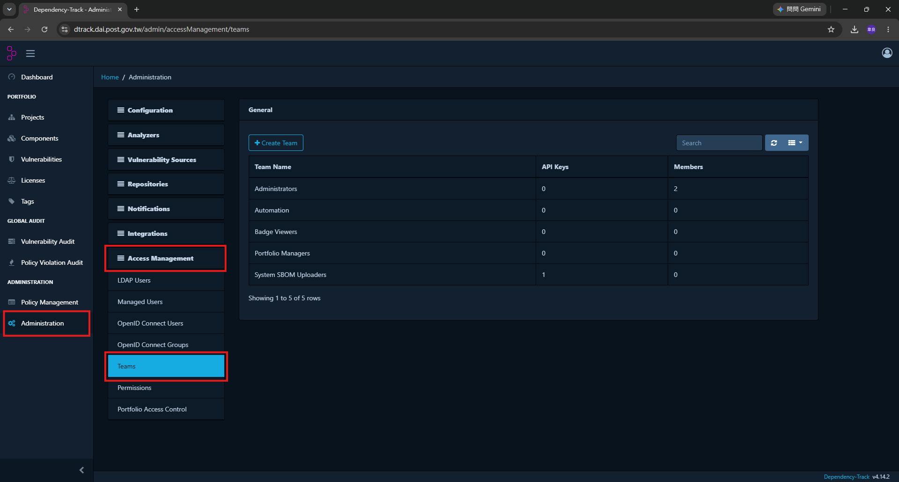

# 10 · D-Track · 專案、API Key 與擋門門檻

> 對象：**要調整 CI 設定或 D-Track 設定的人**。
> 改之前先看懂現在的邏輯——這幾個設定改錯會讓資安掃描靜默失效。

---

## 1. 專案怎麼命名（不要手動改）

`ci/build_sbom.sh` 上傳 SBOM 時用這兩個值：

```bash
PROJECT_NAME="${CI_PROJECT_NAME}"          # GitLab 專案名稱
PROJECT_VERSION="${CI_COMMIT_REF_NAME}"    # 分支名稱
```

搭配 `autoCreate=true`，**專案不存在時 D-Track 會自動建**。

所以 D-Track 上會長出這些：

```
bcp-scripts : main                  ← 正式機在跑的那一版
bcp-scripts : fix/bump-crypto       ← 某個 MR
dagster-workspace : main
dagster-workspace : feature/xxx
```

> ⚠️ **不要在 D-Track 網頁上手動改專案名稱或版本。**
> 下次 CI 跑的時候會照原本的名字再建一個新的，你會得到兩份、而且只有一份是活的。

**清理舊分支的專案**：合併後的功能分支專案不會自己消失，
半年清一次即可（Projects → 勾選 → Delete），不影響 `main`。

---

## 2. API Key

### 建立

**UI 路徑（D-Track v4.14.2）**：

```
左側選單 Administration
  → 中間清單 Access Management
  → 展開後選 Teams
  → + Create Team
```



現有的 team（`System SBOM Uploaders` 就是 CI 在用的那個）：

| Team | 用途 |
|---|---|
| `Administrators` | 系統管理 |
| `Automation` | 自動化 |
| `Badge Viewers` | 只看徽章 |
| `Portfolio Managers` | 專案管理 |
| **`System SBOM Uploaders`** | **CI 上傳 SBOM 與自動放行 OS 套件用的 API Key 放這裡** |

CI 用的 team 權限勾這五個：

| 權限 | 為什麼需要 |
|---|---|
| `BOM_UPLOAD` | 上傳 SBOM |
| `VIEW_PORTFOLIO` | 查專案 UUID |
| `VIEW_VULNERABILITY` | 讀弱點數量與 findings 清單 |
| `PROJECT_CREATION_UPLOAD` | `autoCreate=true` 自動建專案 |
| **`VULNERABILITY_ANALYSIS`** | **自動放行 OS 層套件（`ci/dtrack_suppress_os.sh`）** |

> ⚠️ **`VULNERABILITY_ANALYSIS` 是一個「能讓紅燈變綠燈」的權限**，
> 給 CI 是刻意的取捨：
>
> - **給了它**，`ci/dtrack_suppress_os.sh` 才能自動放行 glibc 這類 OS 套件，
>   讓真正該看的弱點浮出來
> - **範圍是安全的**，因為腳本寫死只碰 `pkg:deb/` `pkg:rpm/` `pkg:apk/` 三種 purl，
>   而且那份程式碼要走 MR 才改得動
>
> 不想承擔這個授權的話，設 `DTRACK_OS_SUPPRESS=0` 關掉自動放行，
> 權限也就可以拿掉——代價是每次掃描都會被幾百個 OS 弱點淹沒。

**不要**給 `PORTFOLIO_MANAGEMENT`（能刪專案）或 `ACCESS_MANAGEMENT`（能改權限）。

建好之後在該 team 頁面底下 **Create API Key**。

### 填進 GitLab

```
該 project → Settings → CI/CD → 展開 Variables
  → 確認你是加在 ★Project variables★ 區塊（不是 Group variables (inherited)）
  → Add variable
```

| Key | Value | Flags |
|---|---|---|
| `DTRACK_URL` | `https://dtrack.dai.post.gov.tw` | ☑ Protect |
| `DTRACK_API_KEY` | `odt_xxxxxxxx` | ☑ Protect ☑ Mask |

`dagster-workspace` 還要多一個：

| Key | Value |
|---|---|
| `DTRACK_IMAGE` | `gitlab.dai.post.gov.tw:5050/<group>/<project>/dagster:v2.7` |

> **為什麼放 Project 不放 Group**：`DTRACK_URL` / `DTRACK_API_KEY` 兩個 repo 相同，
> 放 group 也可以；但 `DEPLOY_HOST` 之類的變數兩個 repo 不同，
> 混在 group 會推錯機器。為了「一個 project 的設定在一個地方看得完」，
> 建議一律設在 Project variables。

### 輪替

API Key 外洩或人員異動時：

1. D-Track → Administration → Access Management → Teams → 該 team → 刪掉舊 Key → Create 新的
2. 更新兩個 repo 的 `DTRACK_API_KEY`（Project variables）
3. 手動觸發一次 pipeline 確認還能上傳

---

## 3. 權限統一在 Keycloak 管

**人的權限不在 D-Track 上一個一個開**，而是由 Keycloak 群組對應到 D-Track team。

### 對應機制

```
Keycloak 群組（成員來自公司 LDAP）
      │  使用者用 OpenID 登入 D-Track
      ▼
D-Track: Administration → Access Management → OpenID Connect Groups
      │  在這裡把「Keycloak 群組名稱」對應到「D-Track team」
      ▼
該 team 的權限就是這個人的權限
```

**UI 路徑**：
```
Administration → Access Management → OpenID Connect Groups
  → 找到（或新增）Keycloak 傳過來的群組
  → 指定它對應到哪一個 Team
```

### 建議的群組規劃

| Keycloak 群組 | 對應 D-Track Team | 權限 |
|---|---|---|
| `dai-viewer` | `Badge Viewers` 或自建的唯讀 team | `VIEW_PORTFOLIO`、`VIEW_VULNERABILITY` |
| `dai-security` | 自建的資安 team | 上面兩個 + `VULNERABILITY_ANALYSIS` |
| `dai-admin` | `Administrators` | 全部 |

> 📌 **「能把紅燈變綠燈」的權限（`VULNERABILITY_ANALYSIS`）要跟「能看」分開**，
> 而且人數要少。
> 標記例外是一個有安全影響的決定，應該只有少數幾個人做得到。

### 好處

| | 在 D-Track 上開帳號 | 統一在 Keycloak 管 |
|---|---|---|
| 新人加入 | 要記得在 D-Track 也開一份 | 加進 Keycloak 群組就好 |
| 離職 | **容易漏掉**，帳號會留著 | LDAP 停用 → 登不進任何系統 |
| 稽核「誰有權限」 | 要一套一套系統查 | 看 Keycloak 群組成員即可 |

> ⚠️ **不要用 D-Track 的 Managed Users 手動建帳號。**
> 那會變成一個不受 LDAP 管理的帳號，離職時不會被停用。
> `Administration → Access Management → Managed Users` 底下應該只有救援用的 `admin`。

---

## 4. 調整擋門門檻

門檻由 `ci/build_sbom.sh` 的環境變數控制：

| 變數 | 預設 | 效果 |
|---|---|---|
| （無條件） | — | **Critical > 0 一律擋**，不能關 |
| `DTRACK_FAIL_ON_HIGH` | `0` | 設 `1` 時 **High > 0 也擋** |
| `DTRACK_FAIL_ON_MEDIUM` | `0` | 設 `1` 時 **Medium > 0 也擋** |
| `DTRACK_POLL_MAX` | `12` | 等分析完成的輪數（每輪 5 秒） |
| `DTRACK_OS_SUPPRESS` | `1` | 設 `0` 關掉 OS 層套件自動放行 |

現在的設定寫在 `.gitlab-ci.yml`：

```yaml
sca-dtrack:                      # 推送 / MR 時跑
  variables:
    DTRACK_FAIL_ON_HIGH: "1"     # 日常：Critical + High 就擋

sca-dtrack-quarterly:            # 每季排程 / 手動
  variables:
    DTRACK_FAIL_ON_HIGH: "1"
    DTRACK_FAIL_ON_MEDIUM: "1"   # 每季：連 Medium 也擋
    DTRACK_POLL_MAX: "36"        # 全量重新分析比較慢，給到 180 秒
```

### 為什麼日常敢擋到 High

因為 OS 層套件（`glibc`、`libc-bin`…）已經由 `ci/dtrack_suppress_os.sh`
自動放行，不會灌爆數字。剩下的 High 都是「我們自己選的套件」，
數量可控、也真的該處理。

> ⚠️ **如果把 `DTRACK_OS_SUPPRESS` 關掉，一定要同時把門檻放寬回 Critical**，
> 否則每個 MR 都會被幾百個 base image 的 OS 弱點擋住，
> 最後的結果不是「大家都很認真修弱點」，而是「有人來要求把這個 job 關掉」。

### 想暫時放寬（緊急）

**不要改檔案**，用手動觸發時帶變數：

```
Run pipeline → Variables → DTRACK_FAIL_ON_HIGH = 0
（每季掃再加一個 DTRACK_FAIL_ON_MEDIUM = 0）
```

只影響那一次執行，不會留下永久的設定漏洞。
放行的原則與必須留的紀錄見
[日常維運 · 04 · 第 7 節](../日常維運/04_弱掃紅燈與MR被卡住的解除流程.md#7-緊急放行最後手段)。

---

## 5. 兩個 repo 的 SBOM 來源

| repo | 來源 | 判斷方式 |
|---|---|---|
| `bcp-scripts` | `requirements.txt` | repo 裡有這個檔案就用它 |
| `dagster-workspace` | 映像檔 `$DTRACK_IMAGE` | repo 裡沒有 requirements.txt，改抓映像檔裡的套件清單 |

兩個都沒有的話，`ci/build_sbom.sh` **直接讓 job 失敗**：

```
產不出 SBOM：repo 裡沒有 requirements.txt，也沒有設定 DTRACK_IMAGE。
```

> 📌 **這是刻意的，不要改成「跳過」。**
> 只掃 repo 裡的檔案的話，`dagster-workspace` 會掃出「零個套件」然後綠燈——
> 完全是假的，真正在 VM4 上跑的那一堆套件一個都沒被檢查到。
> **一個靜默跳過的資安掃描，比沒有掃描更危險。**

### `bcp-scripts` 的 requirements.txt 要跟 VM1 一致

```bash
# 在 VM1
source /run/media/root/D/python_env/dai_venv/bin/activate
python -m pip freeze > requirements.txt
```

走正常 MR 流程推上來。**不一致的話，掃的是紙上的環境，不是真正在跑的環境。**

---

## 6. 每季排程設定

兩個 repo **各建兩個排程**（共四個）。這裡只講弱掃那個，
雜湊對帳那個見 [GitLab維運手冊 · 12](../../GitLab維運手冊/進階調整/12_同步完整性稽核.md)。

```
GitLab UI → Build → Pipeline schedules → New schedule
```

| 欄位 | 值 |
|---|---|
| Description | `每季定期弱掃` |
| Interval Pattern | `0 3 1 */3 *` ← 1/4/7/10 月的 1 號 03:00 |
| Cron timezone | `Asia/Taipei` |
| Target branch | `main` |
| **Variables** | `SCHEDULE_TYPE` = `quarterly` |
| Activated | ✅ |

> ⚠️ **`SCHEDULE_TYPE` 不能漏、不能跟每日對帳排程設成一樣。**
> 兩者都是 `$CI_PIPELINE_SOURCE == "schedule"`，沒有變數區分的話，
> 每天早上的對帳排程會把整套資安複掃也拉起來跑（D-Track 每天被灌一次 SBOM），
> 每季的弱掃又會多跑一次雜湊對帳。

### 驗證排程設定正確

不要等三個月。設完之後直接手動跑一次：

```
Pipeline schedules → 該排程右邊的 ▶ (Play) 按鈕
  → 確認只有 sca-dtrack-quarterly 跑起來
  → 確認 verify job 沒有被拉起來
```

---

## 7. artifacts 保留期限

| job | 保留 | 為什麼 |
|---|---|---|
| `sca-dtrack` | 1 週 | 日常用，過期就沒意義 |
| `sca-dtrack-quarterly` | **1 年** | **稽核用**：要能證明某季掃過、掃到什麼 |

`bom.json` 是那次掃描的完整套件清單，稽核問「去年 Q3 你們用的是哪一版」時，
這是唯一拿得出來的證據。**不要為了省空間把它改短。**

---

## 相關文件

- 掃出東西怎麼處理 → [日常維運 · 04](../日常維運/04_弱掃紅燈與MR被卡住的解除流程.md)
- 弱點報告怎麼看 → [日常維運 · 03](../日常維運/03_D-Track_看懂弱點報告.md)
- CI pipeline 全貌 → [GitLab維運手冊 · 10_CI_Pipeline設定詳解](../../GitLab維運手冊/進階調整/10_CI_Pipeline設定詳解.md)
- 弱掃設計理由 → [GitLab維運手冊 · 15_D-Track定期弱掃](../../GitLab維運手冊/進階調整/15_D-Track定期弱掃.md)
