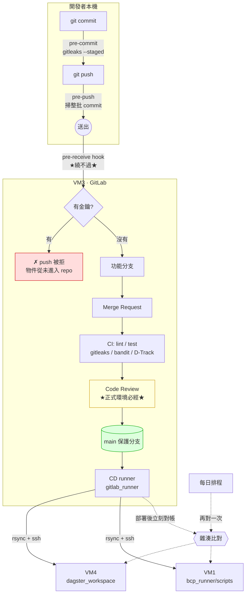

# GitLab 維運手冊

Dagster 手冊講「**改什麼**」，這套手冊講「**怎麼把改動安全地送上正式機**」。

| 分類 | 意思 | 誰會用 |
|---|---|---|
| **日常維運** | 照著步驟做就好，不需要理解 CI/CD 內部機制 | 開發人員、維運人員 |
| **進階調整** | 要改 pipeline 或伺服器設定，改之前必須先看懂現在的邏輯 | GitLab 管理員 |

---

## 先看這篇

📘 **[00_架構與同步機制總覽.md](./00_架構與同步機制總覽.md)**
兩個 repo、三台機器、四道資安關卡怎麼串起來。第一次接觸請先看完。

📂 **[../README.md](../../gitlab_workspace/README.md)**
`gitlab_workspace/` 每個檔案放什麼、每一支 CI/CD 程式在做什麼。

---

## 日常維運

| 文件 | 內容 | 對象 |
|---|---|---|
| [01_開發人員_日常開發流程](./日常維運/01_開發人員_日常開發流程.md) | 開分支 → push → MR → review → 合併 → 上線，一整趟怎麼走 | **開發人員** |
| [02_維運人員_每日檢查](./日常維運/02_維運人員_每日檢查.md) | 每天要看哪些 pipeline、雜湊對帳紅了怎麼辦 | **維運人員** |
| [03_本地環境設定與提交前檢查](./日常維運/03_本地環境設定與提交前檢查.md) | 新機器怎麼裝 hook 與工具、被擋了怎麼修 | **開發人員** |
| [04_帳號_權限_分支保護](./日常維運/04_帳號_權限_分支保護.md) | 新人加入、離職移除、分支保護怎麼設 | GitLab 管理員 |
| [05_trivy_漏洞資料庫更新](./日常維運/05_trivy_漏洞資料庫更新.md) | air-gapped 環境下怎麼更新 Trivy 的弱點資料庫（重建 `dai/trivy` image） | 維運人員 |

---

## 進階調整

| 文件 | 涵蓋什麼 |
|---|---|
| [10_CI_Pipeline設定詳解](./進階調整/10_CI_Pipeline設定詳解.md) | 每個 job 在做什麼、四道資安關卡的先後順序、pre-receive hook 怎麼裝 |
| [11_CD_rsync部署機制](./進階調整/11_CD_rsync部署機制.md) | rsync 參數為什麼這樣下、排除清單怎麼維護、rollback |
| [12_同步完整性稽核](./進階調整/12_同步完整性稽核.md) | 雜湊怎麼算、排程怎麼設、對不上的時候怎麼查 |
| [13_Variables與環境隔離](./進階調整/13_Variables與環境隔離.md) | 同一個 GitLab 怎麼讓測試碰不到正式 DB |
| [14_疑難排解](./進階調整/14_疑難排解.md) | 症狀對照表 |
| [15_D-Track定期弱掃](./進階調整/15_D-Track定期弱掃.md) | SCA 怎麼運作、每季定期複掃怎麼設、掃出弱點怎麼處理 |

---

## 附錄

| 文件 | 內容 |
|---|---|
| [A · gitlab_runner 帳號與 SSH 金鑰](./附錄/A_gitlab_runner帳號與SSH金鑰.md) | 三台 VM 的帳號建立、免密碼登入、金鑰輪替 |
| [B · bcp-scripts repo 建立步驟](./附錄/B_bcp-scripts_repo建立步驟.md) | 當初怎麼從 VM1 現有檔案初始化那個 repo |
| [C · 新 repo 納入 CI/CD](./附錄/C_新repo納入CICD.md) | **又要開一個新 repo 時照這個做** |

---

## 一句話版本

> 兩個 repo（`dagster-workspace` → VM4、`bcp-scripts` → VM1），
> 各自 push 時被四道資安關卡檢查，
> 開 MR 給人 review，合併進 `main` 之後由 VM3 的 CD runner
> 用 rsync 推到對應的正式機，推完立刻對一次雜湊，之後每天再對一次。

